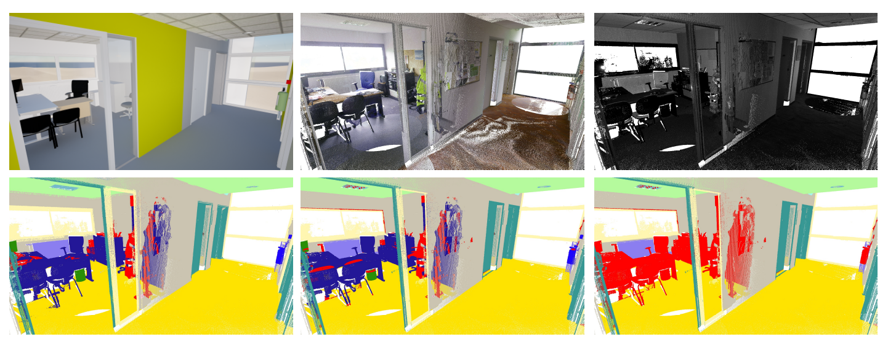

<div align="center">

# 3DSES an indoor Lidar point cloud segmentation dataset with real and pseudo-labels from a 3D model

[//]: # ([![Paper]&#40;https://img.shields.io/badge/paper-arxiv.1001.2234-B31B1B.svg&#41;]&#40;https://www.nature.com/articles/nature14539&#41;)
[//]: # ([![Conference]&#40;https://img.shields.io/badge/AnyConference-year-4b44ce.svg&#41;]&#40;https://papers.nips.cc/paper/2020&#41;)


Official implementation for
<br>
<br>
[_3DSES an indoor Lidar point cloud segmentation dataset with real and pseudo-labels from a 3D model_](https://arxiv.org/abs/2501.17534) (VISAPP 2025)
<br>
[](https://arxiv.org/abs/2501.17534)
[](https://doi.org/10.5281/zenodo.13323342)
[](https://www.codabench.org/competitions/6927/)
<br>
</div>

```
@misc{mérizette20253dsesindoorlidarpoint,
      title={3DSES: an indoor Lidar point cloud segmentation dataset with real and pseudo-labels from a 3D model}, 
      author={Maxime Mérizette and Nicolas Audebert and Pierre Kervella and Jérôme Verdun},
      year={2025},
      eprint={2501.17534},
      archivePrefix={arXiv},
      primaryClass={cs.CV},
      url={https://arxiv.org/abs/2501.17534}, 
}
```

## 🗃️  Description

<p align="center">
  
</p>

**3DSES (3D Segmentation of ESGT point clouds)** is a new dataset of indoor dense TLS colorized point clouds covering 427 m² of an engineering school. 3DSES has a unique double annotation format: semantic labels annotated at the point level alongside a full 3D CAD model of the building


<div align="center">
      
|                 ✨ 3DSES features ✨                 |
|:----------------------------------------------------:|
|                    🏗️ **3D model**                   |
|                📶 **Lidar intensity**                |
|           ↗️ **Extreme point clouds density**            |
|               🎨 **Color information**               |
      
</div>


## 🚀 Codabench 🚀
🎉 We release a Codabench [here](https://www.codabench.org/competitions/5712/). 🎮 Join the competition 🏁

## 📊 Download
The 3DSES dataset can be accessed from our Zenodo repository: [3DSES on Zenodo](https://zenodo.org/records/13323342)

## 📈 Dataloader & Notebook
We provide a Jupyter Notebook with an example of loading a batch for our dataset [here](https://github.com/merizetm/3dses/tree/main/notebook). We also provide a Torch DataLoader [here](https://github.com/merizetm/3dses/tree/main/dataloader).
